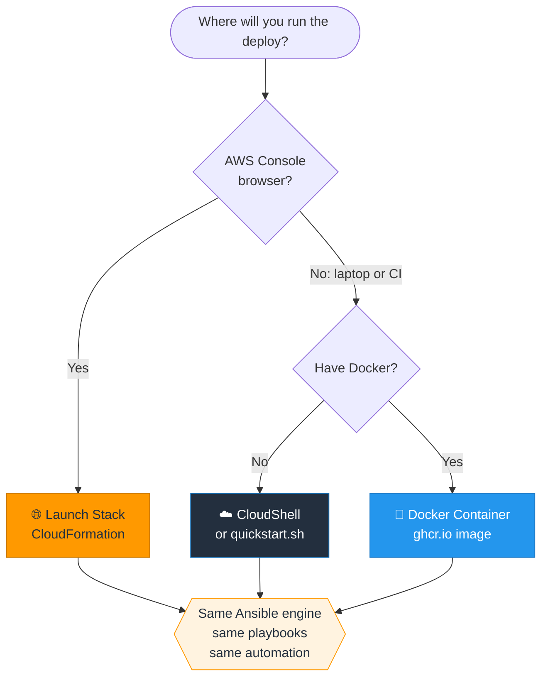
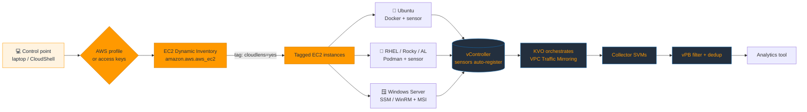

# CloudLens Ansible for AWS

**Deploy the full CloudLens stack (vController + KVO + vPB) and push sensors to every EC2 instance. One command, or one click from the AWS Console.**


🌐 **Live docs:** https://keysight-tech.github.io/cloudlens-ansible-aws/

<p align="center">
  <a href="https://console.aws.amazon.com/cloudformation/home?region=us-east-1#/stacks/quickcreate?templateURL=https://raw.githubusercontent.com/Keysight-Tech/cloudlens-ansible-aws/main/deploy/cloudformation/stack.yaml&stackName=cloudlens-stack"></a>
  <a href="https://console.aws.amazon.com/cloudshell?region=us-east-1"></a>
  <a href="https://github.com/Keysight-Tech/cloudlens-ansible-aws/pkgs/container/cloudlens-ansible-aws"></a>
</p>

---

## Deploy the full stack with one command

Three ways to deploy vController + KVO (optional) + vPB (optional) + sensors end to end. Same result, different workflows.

> **Naming note:** Keysight rebranded CLMS to **vController** in 2026. **KVO** (Keysight Vision One) is the orchestrator that drives AWS VPC Traffic Mirroring and manages vPB fleets. All three come from the AWS Marketplace AMIs; the stack template deploys them into a shared VPC, with KVO and vPB behind toggles (`DeployKVO` / `DeployVPB`, default yes).

### Bash (recommended)

```bash
curl -sSL https://raw.githubusercontent.com/Keysight-Tech/cloudlens-ansible-aws/main/deploy/deploy-stack.sh | bash
```

**Prerequisites the script handles for you:**
- Submits `deploy/cloudformation/stack.yaml` and waits for `CREATE_COMPLETE`
- Polls vController and KVO until their UIs are reachable
- Chains `quickstart.sh` to install sensors on every tagged EC2 instance

**Prerequisites you need:**
- A bash shell (built-in on macOS / Linux / WSL / AWS CloudShell)
- AWS CLI v2 authenticated (SSO or access keys), or just run it inside CloudShell
- A **one-time Marketplace subscription** to the three Keysight AMIs (see below)
- An EC2 key pair in the target region

### CloudFormation (one click)

<p>
  <a href="https://console.aws.amazon.com/cloudformation/home?region=us-east-1#/stacks/quickcreate?templateURL=https://raw.githubusercontent.com/Keysight-Tech/cloudlens-ansible-aws/main/deploy/cloudformation/stack.yaml&stackName=cloudlens-stack"></a>
</p>

The button opens the CloudFormation quick-create console with `deploy/cloudformation/stack.yaml` pre-loaded from this repo. Pick your key pair and admin CIDR, acknowledge IAM capabilities, and click Create Stack. About 5 minutes to `CREATE_COMPLETE`; read the Outputs tab for the vController, KVO, and vPB URLs.

Prefer the CLI?

```bash
aws cloudformation deploy \
  --stack-name cloudlens-stack \
  --template-file deploy/cloudformation/stack.yaml \
  --parameter-overrides KeyPairName=my-keypair AdminIngressCidr=203.0.113.10/32 \
  --capabilities CAPABILITY_NAMED_IAM \
  --region us-east-1

aws cloudformation describe-stacks --stack-name cloudlens-stack \
  --query "Stacks[0].Outputs" --output table --region us-east-1
```

### Terraform stack module

```bash
cd deploy/terraform/stack
cp terraform.tfvars.example terraform.tfvars
# edit: region, key_pair_name, admin_cidr, deploy_kvo, deploy_vpb
terraform init && terraform apply
terraform output
```

Same Marketplace AMIs, same result. The `stack` module wraps the per-component `clms`, `kvo`, and `vpb` child modules under `deploy/terraform/`. Use the child modules directly for bring-your-own-VPC deployments.

### Printable runbook

[CloudLens_Stack_Deployment_Runbook.pdf](docs/CloudLens_Stack_Deployment_Runbook.pdf) is the executive-facing stack guide. [CloudLens_Ansible_AWS_Customer_Runbook.pdf](docs/CloudLens_Ansible_AWS_Customer_Runbook.pdf) is the sensor-deployment runbook. Hand either to procurement or training teams.

All three paths deploy the same AWS resources and chain through vController, KVO (optional), vPB (optional), and sensor deployment.

### Configuration and overrides (deploy-stack.sh)

Every default is overridable three ways: **CLI flag wins over env var wins over hardcoded default**. Run `bash deploy-stack.sh --help` for the in-script reference, or use this table:

| Default | CLI flag | Env var | Notes |
|---|---|---|---|
| `cloudlens-stack` | `--stack-name <name>` | `CLOUDLENS_STACK_NAME` | CloudFormation stack name |
| `us-east-1` | `--region <region>` | `CLOUDLENS_REGION` | Region must carry the Marketplace AMIs |
| (required) | `--key-pair <name>` | `CLOUDLENS_KEY_PAIR` | EC2 key pair for OS SSH |
| `0.0.0.0/0` | `--admin-cidr <cidr>` | `CLOUDLENS_ADMIN_CIDR` | Narrow to your admin + sensor network |
| `yes` | `--with-kvo` / `--no-kvo` | `CLOUDLENS_DEPLOY_KVO` | Deploy the KVO orchestrator |
| `yes` | `--with-vpb` / `--no-vpb` | `CLOUDLENS_DEPLOY_VPB` | Deploy the Virtual Packet Broker |
| `10.99.0.0/16` | `--vpc-cidr <cidr>` | `CLOUDLENS_VPC_CIDR` | Demo VPC CIDR |
| (toggle) | `--no-sensors` | n/a | Skip the sensor playbook chain |
| `false` | `--dry-run` | n/a | Print every aws command, touch nothing |
| `cloudlens` | `--discovery-tag-key <key>` | `CLOUDLENS_DISCOVERY_TAG_KEY` | Tag key that marks "install sensor here" |
| `yes` | `--discovery-tag-value <value>` | `CLOUDLENS_DISCOVERY_TAG_VALUE` | Tag value paired with the key above |

**Three patterns customers use:**

```bash
# 1. Take everything as-is (inside CloudShell)
curl -sSL .../deploy-stack.sh | bash

# 2. Env-var overrides (cleanest for curl|bash)
CLOUDLENS_KEY_PAIR=my-key CLOUDLENS_ADMIN_CIDR=203.0.113.10/32 curl -sSL .../deploy-stack.sh | bash

# 3. Full prod-style with flags
bash deploy-stack.sh \
  --stack-name prod-visibility --region us-east-1 \
  --key-pair prod-key --admin-cidr 10.0.0.0/8 \
  --with-kvo --with-vpb \
  --discovery-tag-key monitoring --discovery-tag-value enabled
```

---

## Marketplace AMIs (subscribe once per account)

The stack launches Marketplace AMIs. Subscribe once per AWS account, then deploy as many times as you like. Instance types are fixed to the size each AMI is qualified on.

| Component | Role | Instance type | us-east-1 AMI | Marketplace listing |
|---|---|---|---|---|
| **vController** (CLMS) | Sensor management + registration | `t3.xlarge` | `ami-0bebd5e730315337e` | Keysight CloudLens Manager |
| **KVO** (Keysight Vision One) | Orchestrator, Cloud Config, analytics | `c5.2xlarge` | `ami-017c0db8981569380` | Keysight Vision One |
| **vPB** (Virtual Packet Broker) | Filter, dedup, load balance | `t3.xlarge`, SSH on port **9022** | `ami-0a561b450552b707d` | Keysight CloudLens Virtual Packet Broker |
| **Collector SVM** | VPC Traffic Mirror collector | auto by KVO | `ami-0c22ade3667f8d35a` | (deployed by KVO Zone Tapping) |

> First-time launch requires accepting Marketplace terms interactively on the listing pages. This cannot be automated (AWS requires the click-through). The AMIs are region-locked; to deploy outside us-east-1, look up the equivalent AMI IDs first (see [docs/OPERATIONS.md](docs/OPERATIONS.md#9-the-amis-and-how-to-look-them-up-in-another-region)).

Default vController UI credentials are `admin / Cl0udLens@dm!n` (force-change on first login). vPB SSH + CLI is `admin / ixia` on port 9022.

---

## Sensor quickstart (Ansible)

Already have vController running? Skip the stack and go straight to sensors.

```bash
git clone https://github.com/Keysight-Tech/cloudlens-ansible-aws.git
cd cloudlens-ansible-aws

# 1. Set AWS auth (one of the following)
aws sso login --profile your-profile
# OR
export AWS_ACCESS_KEY_ID=AKIA...
export AWS_SECRET_ACCESS_KEY=...

# 2. Configure
cp customer_input.yaml.example customer_input.yaml
vim customer_input.yaml   # set vController IP + project_key + region + ssh_key_path

# 3. Tag your target EC2 instances:
#    cloudlens=yes   os=ubuntu|rhel|windows   env=prod

# 4. Run
bash quickstart.sh
```

### What it does

1. **Discovers** running EC2 instances tagged `cloudlens=yes` via the `amazon.aws.aws_ec2` dynamic inventory plugin
2. **Groups** them by `os` tag (ubuntu_prod_vms, redhat_prod_vms, windows_prod_vms)
3. **Connects** via SSH (Linux), SSM Session Manager, or WinRM (Windows)
4. **Installs** the CloudLens sensor: Docker on Ubuntu, Podman on RHEL, MSI on Windows
5. **Registers** each sensor with vController using the project key

### Tag your instances

CloudLens Ansible discovers instances by tag. Apply these to every target:

| Tag | Value | Required? |
|---|---|---|
| `cloudlens` | `yes` | Yes |
| `os` | `ubuntu` / `rhel` / `windows` | Yes |
| `env` | `prod` / `dev` / `qa` | Yes |

Bulk-tag a region:

```bash
aws ec2 describe-instances --region us-east-1 \
  --filters Name=instance-state-name,Values=running Name=platform-details,Values="Linux/UNIX" \
  --query "Reservations[].Instances[].InstanceId" --output text \
| xargs -n1 -I {} aws ec2 create-tags --resources {} \
    --tags Key=cloudlens,Value=yes Key=os,Value=ubuntu Key=env,Value=prod
```

### Connection modes

- **Linux SSH (default):** EC2 key pair from `aws.ssh_key_path`; user `ubuntu` (Ubuntu) or `ec2-user` (RHEL / Amazon Linux). Private-only instances go through a bastion ProxyCommand.
- **Linux SSM:** set `aws.linux_connection: "ssm"` and drop the SSH dependency. Needs the SSM Agent + an IAM role with `AmazonSSMManagedInstanceCore`.
- **Windows SSM (recommended):** no inbound ports, IAM-scoped. Set `aws.windows_connection: "ssm"`.
- **Windows WinRM:** port 5985/5986 open in the security group, password via `ANSIBLE_WINRM_PASSWORD`. Set `aws.windows_connection: "winrm"`.

---

## Supported EC2 Scenarios



| OS / Topology | Public IP + SSH | Private + Bastion | SSM (no inbound) | CloudShell |
|---|:---:|:---:|:---:|:---:|
| Ubuntu 20.04 / 22.04 / 24.04 | ✓ | ✓ | ✓ | ✓ |
| RHEL 7 / 8 / 9, Amazon Linux | ✓ | ✓ | ✓ | ✓ |
| Rocky / AlmaLinux | ✓ | ✓ | ✓ | ✓ |
| Windows Server 2019 / 2022 | ✓ (WinRM) | ✓ (SSM) | ✓ | ✓ |

---

## Which path?





All three paths run the same Ansible engine. Pick the entry point that matches how your team works.

---

## Architecture





A single Ansible control point authenticates to AWS, discovers instances by tag, and routes each host to the OS-specific playbook lane. Every sensor self-registers with vController on first start. For the packet path, KVO orchestrates AWS VPC Traffic Mirroring into collector SVMs and a vPB that filters, dedups, and forwards to your tool. Both east-west and north-south traffic is captured, since the sensor taps at the vNIC. No manual per-instance steps.

Full detail: [docs/ARCHITECTURE.md](docs/ARCHITECTURE.md).

---

## Scaling: from 1 instance to 10,000+

| Fleet size | Parallelism | Sharded? | Approx time |
|---|---|---|---|
| 1 to 50 | 50 | No | 5 to 10 min |
| 51 to 200 | 100 | No | 10 to 20 min |
| 201 to 800 | 200 | No | 15 to 30 min |
| 801 to 2,000 | 400 | Yes (auto) | 30 to 60 min |
| 2,001 to 5,000 | 800 | Yes | 1 to 2 hr |
| 10,000+ | 2,500+ | Yes (AWX) | 4+ hr |

Auto-tunes based on discovered instance count. See [docs/SCALING.md](docs/SCALING.md) for KVO infrastructure sizing and VPC Traffic Mirroring limits.

---

## Why Ansible for AWS?

[`cloudlens-autopilot`](https://github.com/Keysight-Tech/cloudlens-autopilot-docs) uses AWS SSM Run Command for sensor deployment, which is optimal for AWS-native customers starting fresh. This repo is for everyone who already has an Ansible workflow:

| You should use this if... | ...else use AutoPilot SSM |
|---|---|
| You already run **Ansible Tower / AWX** | You are starting fresh on AWS |
| You manage **AWS + Azure + GCP** with one playbook | You are AWS-only |
| Your compliance team **disabled SSM** | SSM Agent is allowed |
| You are at **edge / Outposts / Wavelength** | Standard AWS regions |

You can run **both** in the same AWS account; they do not conflict. The sibling [`cloudlens-ansible-azure`](https://github.com/Keysight-Tech/cloudlens-ansible-azure) repo runs the same playbook structure against Azure.

---

## Troubleshooting quick reference

| Symptom | Cause | Fix |
|---|---|---|
| Inventory finds 0 instances | Tags missing | `aws ec2 create-tags --resources <id> --tags Key=cloudlens,Value=yes Key=os,Value=ubuntu Key=env,Value=prod` |
| `ssh admin@vpb -p 22` times out | vPB SSH is on 9022 | Use port 9022 |
| `ssh -p 9022` times out | Security group missing TCP/9022, or KCOS still booting | Add SG rule; wait 10 to 15 min after `running` |
| SSM "0 target instances" | Missing IAM role or SSM Agent stopped | Attach `AmazonSSMManagedInstanceCore`; check `aws ssm describe-instance-information` |
| Sensor not in vController UI | Wrong project key or 443 blocked | Fresh key from Settings > Projects > API Keys; open egress to 443 |
| `UnsupportedOperation` on stack create | Wrong instance type for a Marketplace AMI | KVO must be c5.2xlarge; vController and vPB t3.xlarge |
| Instances fail to launch | Not subscribed to the Marketplace AMIs | Subscribe once per account, then redeploy |

Full reference: [docs/TROUBLESHOOTING.md](docs/TROUBLESHOOTING.md) and [docs/OPERATIONS.md](docs/OPERATIONS.md).

---

## Documentation

| File | Purpose |
|---|---|
| [docs/ARCHITECTURE.md](docs/ARCHITECTURE.md) | Discovery, connection, install pipeline + AWS traffic flow |
| [docs/DEPLOYMENT_GUIDE.md](docs/DEPLOYMENT_GUIDE.md) | Step-by-step customer deploy |
| [docs/OPERATIONS.md](docs/OPERATIONS.md) | Every gotcha: ports, creds, KVO adoption, AMIs |
| [docs/SCALING.md](docs/SCALING.md) | Scale to thousands of instances |
| [docs/TROUBLESHOOTING.md](docs/TROUBLESHOOTING.md) | Common issues and fixes |
| [docs/SE_DEMO_PLAYBOOK.md](docs/SE_DEMO_PLAYBOOK.md) | 30-minute SE demo script |
| [docs/SE_PROSPECT_EMAIL.md](docs/SE_PROSPECT_EMAIL.md) | SE outreach email templates |
| [docs/CUSTOMER_EMAIL.md](docs/CUSTOMER_EMAIL.md) | Post-signature customer comms |

## Related repositories

- [cloudlens-ansible-azure](https://github.com/Keysight-Tech/cloudlens-ansible-azure): same playbook structure on Azure
- [cloudlens-autopilot](https://github.com/Keysight-Tech/cloudlens-autopilot-docs): AWS SSM Run Command sensor deployment

## Getting help

- [GitHub Issues](https://github.com/Keysight-Tech/cloudlens-ansible-aws/issues) for bug reports and feature requests
- Keysight CloudLens engineering: contact your account team

## License

MIT. See [LICENSE](LICENSE).

---

**Version:** v1.0.0 (June 2026)
