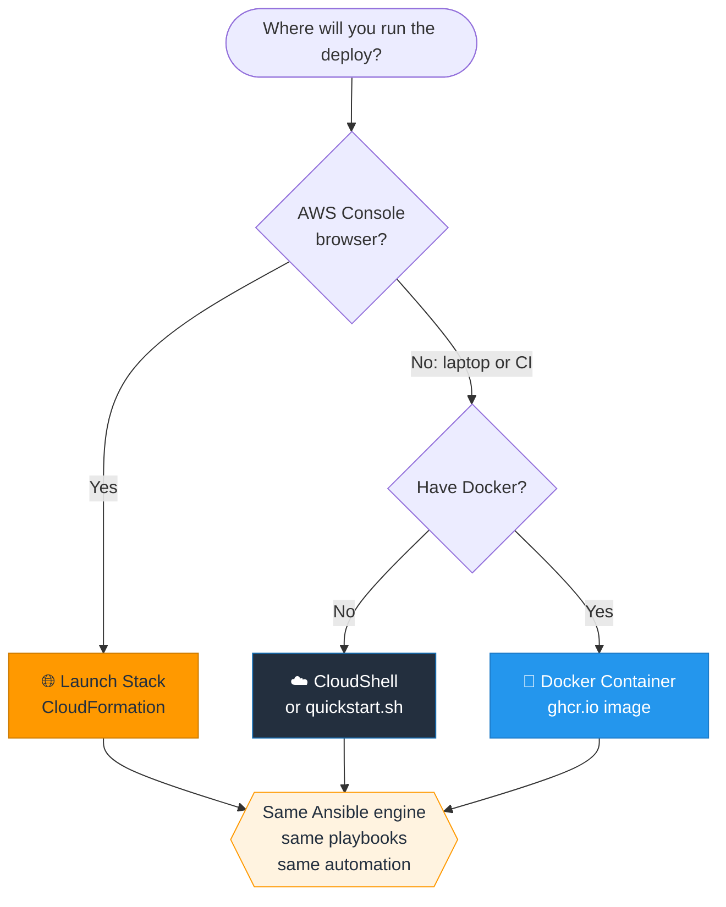
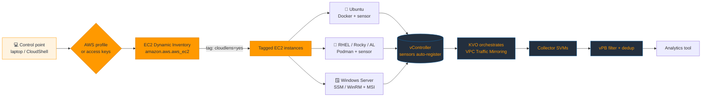

# CloudLens Ansible for AWS

**Deploy the full CloudLens stack (vController + KVO + vPB) and push sensors to every EC2 instance. The console is the front door: `python3 -m cloudlens_console` on your own machine, checking the account first and showing the run as it happens. `deploy/deploy-stack.sh` is the engine it drives, and it is still one command, or one click from the AWS Console, on its own.**


🌐 **Live docs:** https://keysight-tech.github.io/cloudlens-ansible-aws/

<p align="center">
  <a href="https://console.aws.amazon.com/cloudformation/home?region=us-east-1#/stacks/quickcreate?templateURL=https://keysight-cloudlens-templates.s3.us-east-1.amazonaws.com/aws/stack.yaml&stackName=cloudlens-stack"></a>
  <a href="https://console.aws.amazon.com/cloudshell?region=us-east-1"></a>
  <a href="https://github.com/Keysight-Tech/cloudlens-ansible-aws/pkgs/container/cloudlens-ansible-aws"></a>
</p>

---

## Start with the console

A local web UI on the same automation: pre-flight checks with the fix beside each failure, a wizard that ends in a plan you can read before anything runs, the deploy as it happens including the questions it asks you, a view of a stack that is up, KVO licensing, and a gated teardown.

```bash
git clone https://github.com/Keysight-Tech/cloudlens-ansible-aws.git
cd cloudlens-ansible-aws/console
python3 -m cloudlens_console      # http://localhost:8760
```

It binds loopback only, uses your shell's AWS identity, and needs Python 3.9+ plus the AWS CLI, `bash` (it runs `deploy-stack.sh`) and `ssh` (Operate reads the vPB's counters over it). No secret is stored in the browser: `localStorage` keeps the plan, the page and screen you were on, the last run's id and the light/dark choice, and nothing else. What the wizard writes is a `deploy-profile-<stack>.env` the CLI replays with `--profile`, so anything you click through reproduces in a terminal and the UI can never produce a plan the CLI would refuse. Screens, contracts and limits: [`console/README.md`](console/README.md).

The CLI below is that engine, unchanged. If the terminal is where you live, start there.

## Deploy the full stack with one command

Three ways to stand up vController + KVO (optional) + vPB (optional). Only the bash script carries on past the infrastructure: it mints the project key, licenses KVO, adopts the vController, installs the sensors, taps EKS, adopts the vPB, builds the mirror fabric, wires the vPB path and proves traffic (18 phase steps). The Launch Stack button and the Terraform module build the instances and stop.

> **Naming note:** Keysight rebranded CLMS to **vController** in 2026. **KVO** (Keysight Vision Orchestrator) drives AWS VPC Traffic Mirroring and manages vPB fleets. All three come from the AWS Marketplace AMIs; the stack template deploys them into a shared VPC, with KVO and vPB behind toggles (`DeployKVO` / `DeployVPB`, default yes).

### Bash (recommended)

```bash
curl -sSL https://raw.githubusercontent.com/Keysight-Tech/cloudlens-ansible-aws/main/deploy/deploy-stack.sh | bash
```

**One network, every appliance.** The full stack builds a single VPC with
management, data and tool subnets and puts the vController, the KVO and the
vPB in it. To add an appliance later beside an existing deployment, take the
ids the stack prints in its Outputs (`SharedVpcId`, `SharedSubnetId`,
`SharedSecurityGroupId`, or the one `JoinThisNetwork` line that carries all
three) and hand them to a single-product Launch Stack button as
`ExistingVpcId`, `ExistingSubnetId` and `ExistingSecurityGroupId`, or to the
command line as `--existing-vpc-id` and `--existing-subnet-id` (plus
`--existing-sg-id` to reuse the group). The script reads the VPC's CIDR and
fills the template's `ExistingVpcCidr` parameter so the in-VPC ports open to
your range. Existing-network deploys run on the CloudFormation engine only:
`--iac terraform` refuses the `--existing-*` flags. Every single-product stack prints the
same three ids, so a vController launched on its own can have a KVO or vPB
placed beside it instead of in a VPC of its own.

**To remove everything that deployment created**, when you are done. Put your
stack name in. It audits first, shows what it found with sizes and cost, and
asks before deleting anything:

```bash
curl -sSL https://raw.githubusercontent.com/Keysight-Tech/cloudlens-ansible-aws/main/deploy/teardown-stack.sh | bash -s -- --stack-name YOUR-STACK --region us-east-1
```

If the stack has a KVO, the script offers to release its licences before
deleting anything. Once you have confirmed the teardown it lists what the KVO
holds and asks "Release all N licences from this KVO now?" (default yes;
`--release-licences` answers it when there is no terminal). That order is
deliberate: licences are only ever stripped from a KVO you have already chosen
to destroy, never from one you then decide to keep. The counts return to your
entitlement while the KVO is alive; once it is deleted they cannot be
recovered. A release that leaves the KVO clear is the only thing that skips the
licence-loss confirmation; otherwise the script says why and makes you type the
stack name to accept the loss. The UI route still works too: release them
yourself first, in the KVO under Settings > Product Licensing > Deactivate
licenses, then run the teardown.

**Prerequisites the script handles for you:**
- Submits `deploy/cloudformation/stack.yaml` and waits for `CREATE_COMPLETE`
- Polls vController and KVO until their UIs are reachable
- Chains `quickstart.sh` to install sensors on every tagged EC2 instance

**Prerequisites you need:**
- A bash shell (built-in on macOS / Linux / WSL / AWS CloudShell)
- AWS CLI v2 authenticated (SSO or access keys), or just run it inside CloudShell
- A **one-time Marketplace subscription** to the three Keysight AMIs (see below)
- An EC2 key pair in the target region, or let the script create one: `--key-name NAME` creates it if missing, and without the flag an interactive run lists the region's key pairs to pick from

### CloudFormation (one click)

<p>
  <a href="https://console.aws.amazon.com/cloudformation/home?region=us-east-1#/stacks/quickcreate?templateURL=https://keysight-cloudlens-templates.s3.us-east-1.amazonaws.com/aws/stack.yaml&stackName=cloudlens-stack"></a>
</p>

The button opens the CloudFormation quick-create console with `deploy/cloudformation/stack.yaml` pre-loaded from the `keysight-cloudlens-templates` S3 bucket. Pick an existing key pair from the dropdown (the default; `Create a new key pair for me` is the alternative, and the dropdown still needs a value), set the admin CIDR, acknowledge IAM capabilities, and click Create Stack. About 5 minutes to `CREATE_COMPLETE`; read the Outputs tab for the vController, KVO, and vPB URLs.

Maintainers: the sync workflow (`.github/workflows/sync-cfn-templates.yml`) uploads a changed template only when the `AWS_ROLE_ARN` repo secret is set; without it the job exits green and syncs nothing. After a template change run `bash deploy/scripts/sync-cfn-templates-to-s3.sh` locally, then `bash deploy/scripts/check-launch-buttons.sh` to confirm every button resolves.

Prefer the CLI?

```bash
aws cloudformation deploy \
  --stack-name cloudlens-stack \
  --template-file deploy/cloudformation/stack.yaml \
  --parameter-overrides KeyPairName=my-keypair AdminIngressCidr=203.0.113.10/32 \
  --capabilities CAPABILITY_NAMED_IAM \
  --region us-east-1

aws cloudformation describe-stacks --stack-name cloudlens-stack \
  --query "Stacks[0].Outputs" --output table --region us-east-1
```

### Terraform stack module

```bash
cd deploy/terraform/stack
cp terraform.tfvars.example terraform.tfvars
# edit: region, key_name (or public_key), ssh_ingress_cidrs, https_ingress_cidrs, deploy_kvo, deploy_vpb
terraform init && terraform apply
terraform output
```

Same Marketplace AMIs, same result. The `stack` module wraps the per-component `clms`, `kvo`, and `vpb` child modules under `deploy/terraform/`. Use the child modules directly for bring-your-own-VPC deployments.

**Jump straight to the code:**

| Component | Terraform module | CloudFormation template |
|---|---|---|
| Full stack (vController + KVO + vPB) | [deploy/terraform/stack](deploy/terraform/stack) | [stack.yaml](deploy/cloudformation/stack.yaml) |
| One-shot flat root module (used by `deploy-stack.sh --iac terraform`) | [deploy/terraform](deploy/terraform) | n/a |
| vController (formerly CLMS) | [deploy/terraform/clms](deploy/terraform/clms) | [clms.yaml](deploy/cloudformation/clms.yaml) |
| KVO | [deploy/terraform/kvo](deploy/terraform/kvo) | [kvo.yaml](deploy/cloudformation/kvo.yaml) |
| vPB | [deploy/terraform/vpb](deploy/terraform/vpb) | [vpb.yaml](deploy/cloudformation/vpb.yaml) |

Each Terraform module ships its own README, `variables.tf`, and `terraform.tfvars.example`. The CloudFormation directory has its own [README with Launch Stack links](deploy/cloudformation/README.md).

### Printable runbook

[CloudLens_Stack_Deployment_Runbook.pdf](docs/CloudLens_Stack_Deployment_Runbook.pdf) is the executive-facing stack guide. [CloudLens_Ansible_AWS_Customer_Runbook.pdf](docs/CloudLens_Ansible_AWS_Customer_Runbook.pdf) is the sensor-deployment runbook. Hand either to procurement or training teams.

All three paths create the same AWS resources. The post-deploy chain (project key, KVO licensing and vController adoption, sensors, EKS, vPB adoption, mirror sessions, the vPB traffic path, the traffic proof) is `deploy-stack.sh`'s. After a Launch Stack deploy, run the script with the same `--stack-name` and `--region`: it finds the stack in CloudFormation and continues from the first unfinished phase.

### Configuration and overrides (deploy-stack.sh)

Every default is overridable three ways: **CLI flag wins over env var wins over hardcoded default**. Run `bash deploy-stack.sh --help` for the in-script reference, or use this table:

| Default | CLI flag | Env var | Notes |
|---|---|---|---|
| `cloudlens-stack` | `--stack-name <name>` | `CLOUDLENS_STACK_NAME` | CloudFormation stack name |
| `us-east-1` | `--region <region>` | `CLOUDLENS_REGION` | Region must carry the Marketplace AMIs |
| (prompted) | `--key-name <name>` | `CLOUDLENS_KEY_NAME` | EC2 key pair for OS SSH. Created if missing; omit it on a terminal and the script lists the region's key pairs so you can pick one or create a new one |
| `0.0.0.0/0` (non-interactive fallback only) | `--admin-cidr <cidr>` | `CLOUDLENS_ADMIN_CIDR` | Source CIDR allowed to reach the UI and SSH ports. An interactive run asks and offers this machine's address as a /32. Ignored when `--existing-sg-id` supplies a pre-approved group |
| `yes` | `--with-kvo` / `--no-kvo` | `CLOUDLENS_DEPLOY_KVO` | Deploy the KVO orchestrator |
| `yes` | `--with-vpb` / `--no-vpb` | `CLOUDLENS_DEPLOY_VPB` | Deploy the Virtual Packet Broker |
| `10.99.0.0/16` | n/a (template parameter `VpcCidr`, Terraform `vpc_cidr`) | n/a | CIDR of the new shared VPC; only used when no existing VPC is given. Subnets: `MgmtSubnetCidr` 10.99.1.0/24, `DataSubnetCidr` 10.99.11.0/24, `ToolSubnetCidr` 10.99.12.0/24 |
| (toggle) | `--no-sensors` | n/a | Skip the sensor playbook chain |
| `false` | `--dry-run` | n/a | Print every aws command, touch nothing |
| `cloudlens` | `--discovery-tag-key <key>` | `CLOUDLENS_DISCOVERY_TAG_KEY` | Tag key that marks "install sensor here" |
| `yes` | `--discovery-tag-value <value>` | `CLOUDLENS_DISCOVERY_TAG_VALUE` | Tag value paired with the key above |
| `standalone` | `--sensor-mode standalone, kvo or none` | `CLOUDLENS_SENSOR_MODE` | Which project key the sensors register with; `kvo` runs licensing and adoption before the sensors because the key does not exist until the Cloud Config provisions it |
| (prompted) | `--kvo-codes CODE[,QTY]` | n/a | KVO activation code, repeatable; passed to scripts/kvo_license.py |
| `cloudlens-aws` | `--cloud-config <name>` | `CLOUDLENS_CLOUD_CONFIG` | KVO Cloud Config; creating it provisions the CLM project and its sensor key |
| `sensors` (asked on a terminal) | `--tapping sensors, mirror, both or none` | `CLOUDLENS_TAPPING` | How workloads are tapped: agent per VM, agentless VPC Traffic Mirroring (Nitro only), or both |
| `no` | `--with-mirror` / `--no-mirror` | n/a (`CLOUDLENS_TAPPING=mirror` or `both`) | Build the AWS mirror fabric (presence, cloud config, collection, collector SVM, tool, policy, sessions). Needs `--mirror-access-key` / `--mirror-secret-key` (`CLOUDLENS_MIRROR_ACCESS_KEY` / `_SECRET_KEY`): an instance role is not enough |
| every enabled area | `--vpb-rails mirror,k8s` | `CLOUDLENS_VPB_RAILS` | One vPB per area. KVO allows one cloud config per Cloud to Device Link, so the stack vPB serves the first area and one more vPB is launched, adopted and wired per further area |
| `no` | `--with-eks`, `--eks-cluster NAME`, `--eks-sample` | `CLOUDLENS_DEPLOY_EKS`, `CLOUDLENS_EKS_CLUSTER`, `CLOUDLENS_EKS_SAMPLE` (also `_EKS_MODE`, `_EKS_POD_SELECTOR`, `_EKS_SENSOR_IMAGE`, `_EKS_SENSOR_TAR`) | Tap EKS pods. `--eks-mode daemonset` (default) or `sidecar`; `--eks-pod-selector REGEX`; `--eks-sensor-image URI` or `--eks-sensor-tar PATH` |
| `no` | `--discover` | `CLOUDLENS_DISCOVER`, `CLOUDLENS_DISCOVER_REGIONS`, `CLOUDLENS_DISCOVER_ACCOUNTS`, `CLOUDLENS_DISCOVER_ROLE` | Find the VPCs to tap by the discovery tag (`--discover-regions LIST`, `--discover-accounts organization`, `--discover-role NAME`). Read-only; writes inventory/discovered.json and a replayable profile per account and region |
| n/a | `--doctor` | n/a | Check this machine and account for everything the deploy needs and print the fix for each gap. Deploys nothing. Run it first |
| n/a | `--profile FILE or URL` | n/a | Replay saved answers; the plan step writes deploy-profile-<stack>.env after any interview |
| n/a | `--events FILE` | `CLOUDLENS_EVENTS_FILE` | One JSON line per run event; the operations console reads it |
| `cfn` | `--iac cfn or terraform` | `CLOUDLENS_IAC` | Infrastructure engine. Terraform refuses the `--existing-*` flags |
| `yes` | `--public-ip` (default) / `--no-public-ip` | `CLOUDLENS_ASSIGN_PUBLIC_IP` | Elastic IPs on the appliances; a full stack needs 3 free. `--no-public-ip` deploys private addresses only, for private subnets, and the UIs are reached over VPN, Direct Connect or peering |
| (none) | `--existing-vpc-id`, `--existing-subnet-id`, `--existing-data-subnet-id`, `--existing-tool-subnet-id`, `--existing-sg-id` | `CLOUDLENS_EXISTING_VPC_ID`, `_SUBNET_ID`, `_DATA_SUBNET_ID`, `_TOOL_SUBNET_ID`, `_SG_ID` | Deploy into a VPC you already own (see the brownfield section) |

**Three patterns customers use:**

```bash
# 1. Take everything as-is (inside CloudShell)
curl -sSL .../deploy-stack.sh | bash

# 2. Env-var overrides (cleanest for curl|bash)
CLOUDLENS_KEY_NAME=my-key CLOUDLENS_ADMIN_CIDR=203.0.113.10/32 curl -sSL .../deploy-stack.sh | bash

# 3. Full prod-style with flags
bash deploy-stack.sh \
  --stack-name prod-visibility --region us-east-1 \
  --key-name prod-key --admin-cidr 10.0.0.0/8 \
  --with-kvo --with-vpb \
  --discovery-tag-key monitoring --discovery-tag-value enabled
```

### Deploy into a VPC you already have (brownfield)

```bash
bash deploy/deploy-stack.sh --region us-east-1 --stack-name cloudlens-brown \
  --existing-vpc-id vpc-0abc123 --existing-subnet-id subnet-0mgmt \
  --existing-data-subnet-id subnet-0data --existing-tool-subnet-id subnet-0tool \
  --key-name my-key --admin-cidr 203.0.113.10/32
```

- `--existing-vpc-id` plus `--existing-subnet-id` place the appliances in your VPC. `--existing-sg-id` attaches a pre-approved security group instead of creating one (then `--admin-cidr` is ignored).
- The vPB needs `--existing-data-subnet-id` and `--existing-tool-subnet-id` as well, or it comes up management-only and cannot forward traffic. All three subnets must be in the same availability zone.
- The script reads the VPC's CIDR and passes it as the template's `ExistingVpcCidr` parameter, so the in-VPC ports (443, 7443, GRE as IP protocol 47, UDP 4789 and UDP 10800-10801) open to your range and not to the new-VPC default 10.99.0.0/16.
- CloudFormation engine only: `--iac terraform` refuses `--existing-*`.
- Sensors in an existing VPC register to the vController's private address; `CLOUDLENS_SENSOR_MANAGER_ADDR` overrides it for workloads elsewhere.
- An existing EKS cluster in that VPC is tapped with `--eks-cluster NAME`.
- Proven live 2026-10-07 in an existing VPC with an existing EKS cluster and pre-existing tagged workloads: both vPBs adopted and wired (one per rail), the sensor DaemonSet on every node, and the end-to-end traffic proof passing on the mirror path and the vPB path.
- To rehearse, `bash scripts/lab/brownfield-fixture.sh create` (then `status`, `env`, `destroy`) builds a customer-shaped environment: a VPC with management, data and tool subnets in one zone, two tagged workloads talking HTTP, and an EKS cluster. Nothing in it is CloudLens.
- Env vars: `CLOUDLENS_EXISTING_VPC_ID`, `CLOUDLENS_EXISTING_SUBNET_ID`, `CLOUDLENS_EXISTING_DATA_SUBNET_ID`, `CLOUDLENS_EXISTING_TOOL_SUBNET_ID`, `CLOUDLENS_EXISTING_SG_ID`.

---

## If a run stops partway

A deploy can stop for ordinary reasons: Ansible is not installed yet, there is
nothing tagged to put a sensor on, an SSO token expires, a laptop sleeps. None
of that loses the infrastructure already built.

Re-run the same command with `--resume` and it checks the real system rather
than a state file: CloudFormation for the stack, the vController API, the KVO
licensing API. Everything already finished is skipped, and it picks up at the
first unfinished step. That takes about a minute, not another full deploy.

```bash
curl -sSL https://raw.githubusercontent.com/Keysight-Tech/cloudlens-ansible-aws/main/deploy/deploy-stack.sh | bash -s -- \
  --region us-east-1 --stack-name cloudlens-stack --resume
```

Related flags:

| Flag | What it does |
|---|---|
| `--resume` | Continue from the first unfinished phase. The default when there is no terminal. |
| `--fresh` | Run every phase again, skipping nothing. Still deletes nothing. |
| `--from PHASE` | Start at a named phase, in run order: `stack`, `wait`, `bootstrap`, `key`, `license`, `adopt`, `sensors`, `eks`, `vpb`, `mirror`, `path`, `prove`. Names, not numbers: the numbers shift when phases are added. |
| `--only PHASE` | Run exactly one phase. |

Nothing in the deploy script deletes anything, including under `--fresh`. Teardown
is a separate, explicitly confirmed command:

```bash
curl -sSL https://raw.githubusercontent.com/Keysight-Tech/cloudlens-ansible-aws/main/deploy/teardown-stack.sh | bash -s -- --stack-name YOUR-STACK --region us-east-1
```

Add `--orphans` to see what the stack has left loose without deleting anything,
or `--dry-run` to rehearse the whole teardown. When the stack has a KVO the
teardown, once you have confirmed it, offers to release the KVO's licences
before deleting anything (`--release-licences` without a terminal); the KVO
UI's Settings > Product Licensing > Deactivate licenses does the same by hand.
`--kvo-admin-user USER`, `--kvo-admin-pass PASS` and `--kvo-address ADDR` give that release its KVO login and address when the defaults (`CLOUDLENS_KVO_ADMIN_USER` / `_PASS`, a prompt on a terminal, the stack's `KvoAddress` output) do not apply.

Before the stack delete the teardown terminates the extra vPBs that `--vpb-rails` launched outside CloudFormation (tagged `cloudlens:stack=<stack>` and `cloudlens:vpb-rail=<area>`) and releases their Elastic IPs, since they hold the stack security group open. After the delete it sweeps unattached volumes, non-stack security groups in the stack's VPC, the collector Auto Scaling Group and launch templates KVO created, the traffic mirror targets on those collectors and, inside a customer VPC, the resources the deploy stamped; a bare `delete-stack` leaves all of that billing. In a pre-existing `--existing-vpc-id` VPC only the VPC itself and the resources the deploy did not stamp are left alone. Without a terminal it needs `--yes`, plus `--accept-licence-loss` when the KVO still holds licences; `--sweep-only` cleans up after a stack that is already gone and `--no-sweep` deletes the stack and stops.

## Marketplace AMIs (subscribe once per account)

The stack launches Marketplace AMIs. Subscribe once per AWS account, then deploy as many times as you like. Instance types are limited to the sizes each AMI is qualified on, the `AllowedValues` in `stack.yaml`.

| Component | Role | Instance type | us-east-1 AMI | Marketplace listing |
|---|---|---|---|---|
| **vController** (CLMS) | Sensor management + registration | `t3.xlarge` or `m5.xlarge` | `ami-0bebd5e730315337e` | Keysight CloudLens Manager |
| **KVO** (Keysight Vision Orchestrator) | Orchestrator, Cloud Config, analytics | `c5.2xlarge` | `ami-017c0db8981569380` | Keysight Vision Orchestrator: the image `kvo-2.13.0-prod-ol4ektflnyxn2` (KVO 2.13.0) that `deploy-stack.sh` resolves by name in each region; Phase 4 prints its subscribe link |
| **vPB** (Virtual Packet Broker) | Filter, dedup, load balance | `t3.xlarge`, SSH on port **9022** | `ami-0d00b42a9748d580c` | Keysight CloudLens Virtual Packet Broker |
| **Collector SVM** | VPC Traffic Mirror collector | auto by KVO | resolved per region by name (`cloudlens-vpb-svm-*`, newest) | (launched by KVO into an Auto Scaling Group; subscribe to the vPB listing) |

> First-time launch requires accepting Marketplace terms interactively on the listing pages. This cannot be automated (AWS requires the click-through). `stack.yaml` carries the AMIs for us-east-1, us-east-2, us-west-1, us-west-2, ca-central-1, eu-west-1, eu-west-2, eu-central-1, ap-southeast-1, ap-southeast-2, ap-northeast-1 and ap-south-1: pass `--region` and the template's `RegionMap` resolves the region-correct AMIs. Subscribe to the three listings in that region first. For a region outside that list, look up the AMI IDs (see [docs/OPERATIONS.md](docs/OPERATIONS.md#9-the-amis-and-how-to-look-them-up-in-another-region)) and pass them as `CLOUDLENS_VCONTROLLER_AMI`, `CLOUDLENS_KVO_AMI` and `CLOUDLENS_VPB_AMI`.

The vController ships with `admin / Cl0udLens@dm!n` and forces a change on first login; the key phase of the deploy (`--from key`) completes that change to a known value and writes the working login to a mode-600 creds file and to `cloudlens-deploy-summary.txt`. The vPB is reached with the EC2 key pair: `ssh -i <key>.pem -p 9022 admin@<vpb-ip>`, then `sudo vpb -c '<command>'` for the CLI once `scripts/bootstrap-vpb.sh` has run. `admin / ixia` is the device login KVO uses when it adopts the vPB (`scripts/vpb_kvo_adopt.py`), not an SSH password.

---

## Sensor quickstart (Ansible)

Already have vController running? Skip the stack and go straight to sensors.

```bash
git clone https://github.com/Keysight-Tech/cloudlens-ansible-aws.git
cd cloudlens-ansible-aws

# 1. Set AWS auth (one of the following)
aws sso login --profile your-profile
# OR
export AWS_ACCESS_KEY_ID=AKIA...
export AWS_SECRET_ACCESS_KEY=...

# 2. Configure
cp customer_input.yaml.example customer_input.yaml
vim customer_input.yaml   # set vController IP + project_key + region + ssh_key_path

# 3. Tag your target EC2 instances:
#    cloudlens=yes   (optional: os=ubuntu|rhel|windows   env=prod)

# 4. Run
bash quickstart.sh
```

### What it does

1. **Discovers** running EC2 instances matching `aws.tag_filters` in `customer_input.yaml` (default `cloudlens=yes`) via the `amazon.aws.aws_ec2` dynamic inventory plugin
2. **Classifies** each host into `os_ubuntu`, `os_rhel` or `os_windows`: by an `os` tag when present, else by what AWS reports (`platform`, `platform_details`), else by probing the host (`playbooks/classify.yaml`). The legacy `*_prod_vms` groups still exist for labs that target them
3. **Connects** via SSH (Linux), SSM Session Manager, or WinRM (Windows)
4. **Installs** the CloudLens sensor: Docker on Ubuntu, Podman on RHEL, MSI on Windows
5. **Registers** each sensor with vController using the project key

`quickstart.sh` installs the Ansible collections it needs; if galaxy.ansible.com is unreachable but they are already in `./collections`, it warns and continues. A private manager address is accepted: the sensors inside the VPC pull from it, so this machine not reaching it is not a verdict. The Windows sensor is off by default (Windows traffic is already captured by VPC Traffic Mirroring); turn it on with `CLOUDLENS_WINDOWS_SENSOR=true bash quickstart.sh` or `windows: {enabled: true}` in `customer_input.yaml`.

### Tag your instances

CloudLens Ansible discovers instances by tag. Apply these to every target:

| Tag | Value | Required? |
|---|---|---|
| `cloudlens` | `yes` | Only if you keep the default `tag_filters` |
| `os` | `ubuntu` / `rhel` / `windows` | No: it wins when present; otherwise AWS platform details and a probe classify the host |
| `env` | `prod` / `dev` / `test` | No: `deploy.yaml` targets the `os_*` groups. `env` only feeds the legacy `*_prod_vms`, `*_dev_vms` and `*_test_vms` groups |

Bulk-tag a region:

```bash
aws ec2 describe-instances --region us-east-1 \
  --filters Name=instance-state-name,Values=running Name=platform-details,Values="Linux/UNIX" \
  --query "Reservations[].Instances[].InstanceId" --output text \
| xargs -n1 -I {} aws ec2 create-tags --resources {} \
    --tags Key=cloudlens,Value=yes Key=os,Value=ubuntu Key=env,Value=prod
```

### Bring your own workloads

You do not have to re-tag a fleet to use this. Everything under `aws:` in
`customer_input.yaml` drives discovery directly, and `scripts/render_inventory.py`
turns it into the dynamic inventory the run actually uses. Pick one:

```yaml
aws:
  # 1. Your own tags. Every entry must match, so combine as many as you like.
  regions: [us-east-1, eu-west-1]
  tag_filters:
    Environment: "prod"
    Team: "payments"

  # 2. Exactly these instances. Wins over tag_filters.
  instance_ids: [i-0123456789abcdef0, i-0fedcba9876543210]

  # 3. An inventory you already have. Skips AWS discovery entirely: static
  #    hosts, another account, or machines that are not EC2 at all. Put the
  #    connection vars in that file, since inventory/group_vars does not
  #    follow it.
  inventory_file: "/path/to/hosts.ini"
```

`deploy-stack.sh --discovery-tag-key/--discovery-tag-value` writes case 1 for
you. If discovery comes back empty, the run stops and prints which regions and
filters it searched and how many running instances exist in those regions, so
a wrong tag is distinguishable from wrong credentials.

### Connection modes

- **Linux SSH (default):** EC2 key pair from `aws.ssh_key_path`; user `ubuntu` (Ubuntu) or `ec2-user` (RHEL / Amazon Linux). Private-only instances go through a bastion ProxyCommand.
- **Linux SSM:** set `aws.linux_connection: "ssm"` and drop the SSH dependency. Needs the SSM Agent + an IAM role with `AmazonSSMManagedInstanceCore`.
- **Windows SSM (recommended):** no inbound ports, IAM-scoped. Set `aws.windows_connection: "ssm"`.
- **Windows WinRM:** port 5985/5986 open in the security group, password via `ANSIBLE_WINRM_PASSWORD`. Set `aws.windows_connection: "winrm"`.

---

## Supported EC2 Scenarios



| OS / Topology | Public IP + SSH | Private + Bastion | SSM (no inbound) | CloudShell |
|---|:---:|:---:|:---:|:---:|
| Ubuntu 20.04 / 22.04 / 24.04 | ✓ | ✓ | ✓ | ✓ |
| RHEL 7 / 8 / 9, Amazon Linux | ✓ | ✓ | ✓ | ✓ |
| Rocky / AlmaLinux | ✓ | ✓ | ✓ | ✓ |
| Windows Server 2019 / 2022 | ✓ (WinRM) | ✓ (SSM) | ✓ | ✓ |

---

## Which path?


```mermaid
flowchart TD
    Start([Where will you run the deploy?]) --> Browser{AWS Console<br/>browser?}
    Browser -->|Yes| Tier1[🌐 Launch Stack<br/>CloudFormation]
    Browser -->|No: laptop or CI| Docker{Have Docker?}
    Docker -->|Yes| Tier3[🐳 Docker Container<br/>ghcr.io image]
    Docker -->|No| Tier2[☁️ CloudShell<br/>or quickstart.sh]

    Tier1 --> Engine{{Same Ansible engine<br/>same playbooks<br/>same automation}}
    Tier2 --> Engine
    Tier3 --> Engine

    style Tier1 fill:#FF9900,stroke:#CC7A00,color:#232F3E
    style Tier2 fill:#232F3E,stroke:#146EB4,color:#fff
    style Tier3 fill:#2496ED,stroke:#1D7AC7,color:#fff
    style Engine fill:#FFF3E0,stroke:#FF9900,color:#232F3E
```



All three paths run the same Ansible engine. Pick the entry point that matches how your team works.

---

## Architecture


```mermaid
graph LR
    Customer[💻 Control point<br/>laptop / CloudShell] --> Auth{AWS profile<br/>or access keys}
    Auth --> Inventory[EC2 Dynamic Inventory<br/>amazon.aws.aws_ec2]
    Inventory -->|tag: cloudlens=yes| Discover[Tagged EC2 instances]
    Discover --> Ubuntu[🐧 Ubuntu<br/>Docker + sensor]
    Discover --> RHEL[🎩 RHEL / Rocky / AL<br/>Podman + sensor]
    Discover --> Windows[🪟 Windows Server<br/>SSM / WinRM + MSI]
    Ubuntu --> VC[(vController<br/>sensors auto-register)]
    RHEL --> VC
    Windows --> VC
    VC --> KVO[KVO orchestrates<br/>VPC Traffic Mirroring]
    KVO --> SVM[Collector SVMs] --> VPB[vPB filter + dedup] --> Tool[Analytics tool]

    classDef aws fill:#FF9900,stroke:#CC7A00,color:#232F3E
    classDef ctl fill:#FFF3E0,stroke:#FF9900,color:#232F3E
    classDef ks fill:#232F3E,stroke:#146EB4,color:#FF9900
    class Auth,Inventory,Discover aws
    class Customer ctl
    class VC,KVO,SVM,VPB ks
```



A single Ansible control point authenticates to AWS, discovers instances by tag, and routes each host to the OS-specific playbook lane. Every sensor self-registers with vController on first start. For the packet path, KVO orchestrates AWS VPC Traffic Mirroring into collector SVMs and a vPB that filters, dedups, and forwards to your tool. Both east-west and north-south traffic is captured, since the sensor taps at the vNIC. No manual per-instance steps.

Full detail: [docs/ARCHITECTURE.md](docs/ARCHITECTURE.md).

---

## Scaling: from 1 instance to 10,000+

| Fleet size | Parallelism | Sharded? | Approx time |
|---|---|---|---|
| 1 to 50 | 50 | No | 5 to 10 min |
| 51 to 200 | 100 | No | 10 to 20 min |
| 201 to 800 | 200 | No | 15 to 30 min |
| 801 to 2,000 | 400 | No | 30 to 60 min |
| 2,001 to 5,000 | 800 | Yes | 1 to 2 hr |
| 5,001 to 10,000 | 1,500 | Yes | 2 to 4 hr |
| 10,000+ | 2,500+ | Yes | 4+ hr |

Parallelism is the Ansible `forks` setting. The deploy reads it from `ANSIBLE_FORKS` in the environment, then `deploy.forks` in `customer_input.yaml`, and otherwise picks a value from the fleet size (20 forks up to 50 instances, 50 up to 500, 200 up to 2,000, 500 beyond); `deploy/tuned-ansible.cfg` sets 200, and `--forks` on `ansible-playbook` overrides a single run. Above 2,000 instances the deploy shards: `deploy/shard.sh` splits the discovered inventory into shards of 500 (`SHARD_SIZE`) and runs one `ansible-playbook` per shard in parallel, each with its own `--forks` (200 per shard by default). The timing bands in [docs/SCALING.md](docs/SCALING.md) are the reference; it also covers KVO infrastructure sizing and VPC Traffic Mirroring limits.

---

## Why Ansible for AWS?

[`cloudlens-autopilot`](https://github.com/Keysight-Tech/cloudlens-autopilot-docs) uses AWS SSM Run Command for sensor deployment, which is optimal for AWS-native customers starting fresh. This repo is for everyone who already has an Ansible workflow:

| You should use this if... | ...else use AutoPilot SSM |
|---|---|
| You already run **Ansible Tower / AWX** | You are starting fresh on AWS |
| You manage **AWS + Azure + GCP** with one playbook | You are AWS-only |
| Your compliance team **disabled SSM** | SSM Agent is allowed |
| You are at **edge / Outposts / Wavelength** | Standard AWS regions |

You can run **both** in the same AWS account; they do not conflict. The sibling [`cloudlens-ansible-azure`](https://github.com/Keysight-Tech/cloudlens-ansible-azure) repo runs the same playbook structure against Azure.

---

## Troubleshooting quick reference

| Symptom | Cause | Fix |
|---|---|---|
| Inventory finds 0 instances | Tags missing, or `aws.tag_filters` does not match what your instances carry | Read the diagnostic the run prints: it lists the regions and filters searched and the tags your running instances actually have. Then either fix `aws.tag_filters` or tag the hosts: `aws ec2 create-tags --resources <id> --tags Key=cloudlens,Value=yes Key=os,Value=ubuntu Key=env,Value=prod` |
| `ssh admin@vpb -p 22` times out | vPB SSH is on 9022 | Use port 9022 |
| `ssh -p 9022` times out | Security group missing TCP/9022, or KCOS still booting | Add SG rule; wait 10 to 15 min after `running` |
| SSM "0 target instances" | Missing IAM role or SSM Agent stopped | Attach `AmazonSSMManagedInstanceCore`; check `aws ssm describe-instance-information` |
| Sensor not in vController UI | Wrong project key or 443 blocked | Fresh key from Settings > Projects > API Keys; open egress to 443 |
| `UnsupportedOperation` on stack create | Wrong instance type for a Marketplace AMI | KVO must be c5.2xlarge and the vPB t3.xlarge; the vController takes t3.xlarge or m5.xlarge |
| Instances fail to launch | Not subscribed to the Marketplace AMIs | Subscribe once per account, then redeploy |

Full reference: [docs/TROUBLESHOOTING.md](docs/TROUBLESHOOTING.md) and [docs/OPERATIONS.md](docs/OPERATIONS.md).

---

## Documentation

| File | Purpose |
|---|---|
| [docs/ARCHITECTURE.md](docs/ARCHITECTURE.md) | Discovery, connection, install pipeline + AWS traffic flow |
| [docs/DEPLOYMENT_GUIDE.md](docs/DEPLOYMENT_GUIDE.md) | Step-by-step customer deploy |
| [docs/OPERATIONS.md](docs/OPERATIONS.md) | Every gotcha: ports, creds, KVO adoption, AMIs |
| [docs/SCALING.md](docs/SCALING.md) | Scale to thousands of instances |
| [docs/TROUBLESHOOTING.md](docs/TROUBLESHOOTING.md) | Common issues and fixes |
| [docs/SE_DEMO_PLAYBOOK.md](docs/SE_DEMO_PLAYBOOK.md) | 30-minute SE demo script |
| [docs/SE_PROSPECT_EMAIL.md](docs/SE_PROSPECT_EMAIL.md) | SE outreach email templates |
| [docs/CUSTOMER_EMAIL.md](docs/CUSTOMER_EMAIL.md) | Post-signature customer comms |
| [docs/PRODUCTION_DEPLOYMENT.md](docs/PRODUCTION_DEPLOYMENT.md) | The automation tracks and the scripts behind each phase |
| [docs/BROWNFIELD_READINESS.md](docs/BROWNFIELD_READINESS.md) | Deploying into an existing VPC |
| [docs/DISCOVERY.md](docs/DISCOVERY.md) | `--discover`: find the VPCs to tap across regions and accounts |
| [docs/KUBERNETES_RAIL.md](docs/KUBERNETES_RAIL.md) | EKS pod tapping: presence, DaemonSet, its own vPB |
| [docs/AWS_ZONE_TAPPING.md](docs/AWS_ZONE_TAPPING.md) | VPC Traffic Mirroring sequence and the vPB numbers |
| [docs/CLOUD_SECURITY_COMPLIANCE.md](docs/CLOUD_SECURITY_COMPLIANCE.md) | Security and compliance notes for the stack |
| [console/README.md](console/README.md) | The operations console: screens, contracts, limits |

## Related repositories

- [cloudlens-ansible-azure](https://github.com/Keysight-Tech/cloudlens-ansible-azure): same playbook structure on Azure
- [cloudlens-autopilot](https://github.com/Keysight-Tech/cloudlens-autopilot-docs): AWS SSM Run Command sensor deployment

## Getting help

- [GitHub Issues](https://github.com/Keysight-Tech/cloudlens-ansible-aws/issues) for bug reports and feature requests
- Keysight CloudLens engineering: contact your account team

## License

MIT. See [LICENSE](LICENSE).

---

**Version:** see the git log; last functional change 2026-10-07 (brownfield proof: existing VPC, existing EKS cluster, both vPB rails).
